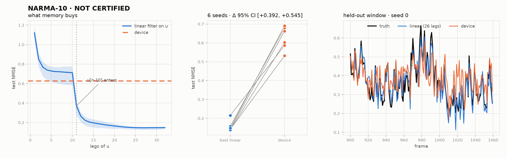

# Certifying the device for NARMA-10

## What is being certified

> The ported vortex disk, driven through one guide and read out only at its six
> ports, predicts NARMA-10 better than the best linear filter on the same input
> history — reproducibly across independent input realisations.

That is a narrow claim on purpose. It is not "the device is good at NARMA-10".
It is the claim that the disk's physical nonlinearity does work a delay line
cannot, on the task the field uses as its reference, and that the margin
survives being measured more than once.

## Why a certification and not another run

The current evidence for this claim is a single number from a single input
draw: reservoir 0.6274 against a linear 10-lag baseline of 0.7324 on 900 frames
with a 150-frame test block. Three separate claims made earlier in this project
on exactly that kind of evidence — an amplitude threshold, a 3.2x memory gain
from port drive, a quadratic-capacity collapse — did not survive being
re-measured with matched controls. A 0.10 margin from one draw is the same shape
of evidence.

## The baseline correction

**Amended before any device data existed for this protocol, and the amendment
is the most consequential thing here.**

The first draft of this document made `linear_10lag` the baseline to beat,
following the rest of this project and the convention that NARMA-*n* is scored
against an *n*-lag filter. Measuring the baselines on the target alone — six
seeds, 1200 frames, the same splits, no device involved — shows that convention
is wrong for this task:

| lags of `u` | test NMSE, mean over 6 seeds |
|---|---|
| 1 | 1.12 |
| 5 | 0.73 |
| 10 | 0.71 |
| **11** | **0.37** |
| 20 | 0.17 |
| 26 (best) | 0.15 |
| 40 | 0.15 |

The whole curve is flat from 3 to 10 lags and then falls off a cliff at 11. That
is not a smooth memory effect — it is an off-by-one. NARMA-10 is

    y[t+1] = 0.3 y[t] + 0.05 y[t] sum(y[t-9..t]) + 1.5 u[t-9] u[t] + 0.1

so the target at index `n` depends on `u[n-10]`. A design matrix of "ten lags"
holds `u[n] ... u[n-9]` and therefore **excludes `u[n-10]`** — one of the two
inputs to the task's own product term. The conventional baseline is missing
precisely the column the task's nonlinearity is built from, and restoring it
halves the error with no extra memory in any meaningful sense.

Past 11 lags the improvement is slower and genuinely about memory: the
`0.3 y[t]` term feeds every past `y` forward, so `u`'s influence outlives the
ten-step window and the filter keeps gaining down to ~26 lags and 0.146. That is
NRMSE 0.38, which is the linear-regression figure NARMA-10 is conventionally
quoted against — confirming the corrected number is the right reference and the
10-lag number is a straw baseline.

The device scores 0.63. It loses to the *minimal correctly specified* linear
filter (11 lags, 0.37) by 1.7x and to the best one (26 lags, 0.15) by 4.3x.

Every earlier NARMA-10 comparison in this project used the straw baseline. The
device's 0.63 does beat 0.71; it loses to 0.17 by a factor of four.

The error is not specific to order 10. `check_task_suite.py` scored every NARMA
order against an *n*-lag filter, so NARMA-2's baseline was **two** lags:

| order | conventional (*n* lags) | best linear | device (port drive, 900 frames) |
|---|---|---|---|
| 2 | 0.7745 | **0.1096** (5 lags) | 0.1461 |
| 3 | 0.6950 | **0.1604** (10) | 0.1908 |
| 5 | 0.6310 | **0.1553** (10) | 0.2436 |
| 10 | 0.7294 | **0.1408** (40) | 0.6267 |

So the NARMA-2 result — the one claim in this project that outlived every other
re-measurement — was also a win over a straw baseline. Against the real one the
device loses at every order. Both baselines are printed by
`check_task_suite.py` now, and the runner prints both too.

## Protocol

**Independent realisations.** Six NARMA-10 sequences, seeds 0-5, each a fresh
`u ~ U[0, 0.5]` draw and its own `y`. Each gets its own full micromagnetic
simulation from the relaxed vortex state, so the six results are independent
samples of the same random variable, not six views of one.

**Matched everything else.** Identical geometry, drive, carrier, tone set,
series length (1200 frames), and splits (150 washout / 600 train / 150 val /
300 test) in every arm and for every baseline. The recurring failure mode in
this project has been comparing runs that differ in more than the variable under
test; here the only thing that varies is the input draw.

**No test-set leakage.** Ridge lambda *and* the baseline's lag count are chosen
on the validation block, never the test block. Feature standardisation uses
training-block statistics only. Every reported number is on 300 frames that
nothing was fitted on.

## Arms

Each is a ridge readout on a different feature set, scored the same way.

| arm | dim | what it establishes |
|---|---|---|
| `constant` | 0 | the scale everything is read against |
| `input_only` | 1 | `u_n` alone. Anything below this is memory. |
| `linear_10lag` | 10 | the conventional baseline, kept only so this connects to the project's earlier numbers and to papers that use it. Off by one: it cannot see `u[n-10]`. |
| `linear_20lag` | 20 | past the cliff, into the region where the recursion is what is being captured |
| `linear_best` | 10-40 | **the baseline that decides.** Depth chosen on validation from {10, 11, 15, 20, 26, 40}. The best purely linear predictor of `y` from `u`'s history. |
| `poly2_10lag` | 65 | ten lags and every product of them: the nonlinearity computed in software for free |
| `device` | 60 | six ports x five lock-in tones x (re, im) |
| `linear_best + device` | +60 | **the residual-value test.** Does the device add anything a linear filter has not already extracted? |
| `device_shifted` | 60 | device features circularly shifted 37 frames against the target. Must return NMSE ~ 1, or the pipeline is scoring alignment that is not there. |

## Decision rule, fixed before the device data

Per seed `k`, paired differences, decided by the upper bound of a two-sided 95%
t-interval over the six seeds.

- **Tier 1 (conventional).** `NMSE(device) < NMSE(linear_10lag)`. Reported for
  comparability. Passing Tier 1 alone certifies nothing — it is a win over a
  baseline now known to be under-powered.
- **Tier 2 (certification).** `NMSE(device) < NMSE(linear_best)`. This is the
  claim at the top of this document. **CERTIFIED** requires this interval to lie
  entirely below zero.
- **Tier 3 (residual value).** `NMSE(linear_best + device) < NMSE(linear_best)`.
  Asks whether the device contributes anything *beyond* what a linear filter
  already extracts, which stays meaningful even when Tier 2 fails. A device that
  cannot beat a linear filter alone but measurably improves on it when appended
  is contributing nonlinear structure; one that does neither is not computing.

All three require the leakage guard (`device_shifted` NMSE > 0.9 on every seed).
A favourable mean with an interval straddling zero is not a pass at any tier:
that is the evidential state the single-draw number is already in.

## Supplementary, and explicitly not certification

Orders 2, 3 and 5 are scored afterwards on the same features and the same seeds,
reusing each seed's own `u` so the device is never scored against a history it
did not experience. This is exploratory: it is nine further comparisons on data
already used once, with no multiplicity adjustment, and it is reported because
NARMA-2 is where this project last claimed a win and where the device comes
closest. A `*` there is a hypothesis worth a fresh pre-registered run, not a
result.

## Calibration

NARMA-10 is usually reported as NRMSE = sqrt(NMSE). The linear reference
measured above is NRMSE 0.38. Published echo-state networks with a few hundred
nodes reach roughly NRMSE 0.2. An NMSE of 0.63 is NRMSE 0.79 — worse than linear
regression on the input.

## How much memory the device actually has

An earlier draft of this document asserted the device holds "about three steps
of usable history". That is wrong, and it matters, because it points at the
wrong fix. Measured directly on the port-drive features — reconstructing
`u[n-k]` from the device state, same splits, same protocol:

| lag | 0 | 1 | 2 | 3 | 4 | 5 | 6 | 7 | 8 |
|---|---|---|---|---|---|---|---|---|---|
| r² | 0.996 | 0.935 | 0.986 | 0.980 | 0.961 | 0.889 | 0.843 | 0.852 | 0.343 |

Jaeger MC 8.17, with r² falling below 0.5 at lag 8. The physical prediction is
`1 / (2 pi alpha N_cycles)` = 8.29 frames at alpha = 0.008 and 2.40 carrier
cycles per frame. **The measured memory matches the ring-down almost exactly**;
nothing is being lost between the magnetisation and the ports.

The "three steps" figure belongs to the earlier uniform-drive, carrier-only
lock-in configuration, whose capacity was 2.6. It is not a property of the
device being certified here.

This changes the diagnosis. A linear filter with eight lags scores 0.72 and the
device scores 0.63, so *matched on memory depth the device wins* — the
nonlinearity is doing work. What it cannot do is reach lag 10, and NARMA-10's
product term needs exactly `u[n-10]`. The device sits one lag short of the cliff.

So the certification's `equivalent_depth` diagnostic is the useful number: the
depth of the shallowest linear filter that matches the device's NMSE. A device
that remembers 8 lags but performs like an 11-lag filter is being helped by its
nonlinearity by that margin; one that performs like an 8-lag filter is not
extracting anything its memory did not already give.

---

# Result

**NOT CERTIFIED for NARMA-10.** Six seeds, 1200 frames each, run to completion
under the protocol above. The decision rule was fixed before any device data
existed and is applied here unchanged.

## Test NMSE by arm, mean over 6 seeds

| arm | 0 | 1 | 2 | 3 | 4 | 5 | mean |
|---|---|---|---|---|---|---|---|
| `constant` | 1.032 | 1.167 | 1.099 | 1.180 | 1.071 | 1.148 | 1.116 |
| `input_only` | 1.042 | 1.167 | 1.098 | 1.193 | 1.071 | 1.154 | 1.121 |
| `linear_10lag` | 0.585 | 0.761 | 0.710 | 0.751 | 0.689 | 0.776 | 0.712 |
| `linear_20lag` | 0.137 | 0.175 | 0.187 | 0.160 | 0.142 | 0.190 | 0.165 |
| **`linear_best`** | 0.141 | 0.158 | 0.215 | 0.142 | 0.139 | 0.148 | **0.157** |
| `poly2_10lag` | 0.681 | 0.862 | 0.743 | 0.818 | 0.697 | 0.796 | 0.766 |
| **`device`** | 0.531 | 0.679 | 0.586 | 0.662 | 0.603 | 0.691 | **0.625** |
| `linear+device` | 0.158 | 0.159 | 0.211 | 0.144 | 0.164 | 0.181 | 0.170 |
| `device_shifted` | 1.074 | 1.180 | 1.112 | 1.266 | 1.067 | 1.220 | 1.153 |

Selected depth for `linear_best`: 26, 26, 15, 40, 40, 40.

**Leakage guard: PASS.** Device features shifted 37 frames against the target
score NMSE 1.067–1.265 on every seed. Misaligned features predict nothing, so
the pipeline is not scoring alignment that is not there.

## The three tiers

| tier | comparison | mean Δ | 95% CI | sign | verdict |
|---|---|---|---|---|---|
| 1 | `device − linear_10lag` | −0.0865 | [−0.110, −0.063] | 6/6 | **PASS** |
| 2 | `device − linear_best` | **+0.4684** | [+0.392, +0.545] | 0/6 | **FAIL** |
| 3 | `(linear+device) − linear_best` | +0.0126 | [−0.003, +0.028] | 1/6 | **FAIL** |

Negative favours the device.

Tier 1 passes cleanly and decisively — t(5) = −9.46, p = 0.0001, every seed in
the same direction. It is also the tier this document said in advance would
certify nothing. The 10-lag baseline cannot see `u[n-10]`, which is the term
NARMA-10's recursion is built on, and beating a baseline that is structurally
blind to the task is not a result.

Tier 2 is the certification and it fails in the wrong direction by a wide
margin: 0.625 against 0.157, a gap of 0.47 NMSE with the interval nowhere near
zero and not one seed dissenting. The device is not close.

Tier 3 fails too, and this is the more informative failure. Appending 60 device
features to the best linear filter does not improve it — the point estimate is
slightly *worse*, and the interval straddles zero. On this task the ports carry
essentially nothing a linear readout has not already extracted from `u`.

## Memory diagnostic

| lag | 0 | 1 | 2 | 3 | 4 | 5 | 6 | 7 | 8 |
|---|---|---|---|---|---|---|---|---|---|
| mean r² | 1.00 | 0.94 | 0.99 | 0.98 | 0.97 | 0.88 | 0.85 | 0.85 | 0.35 |

Jaeger MC **8.12**, r² crossing 0.5 at lag **8.0** — against the ring-down
prediction of 8.29 frames made before the run. The memory is exactly what the
physics says it should be; nothing is lost between the magnetisation and the
ports.

Equivalent depth **11.0**: the device performs like an 11-lag linear filter
while remembering 8. That margin is real and it is the nonlinearity doing work.
It is also not enough, because the task needs `u[n-10]` and the device's memory
ends at 8. It sits one lag short of the cliff, and the cliff is where all the
performance is — a linear filter goes from 0.71 at 10 lags to 0.37 at 11.

## Calibration

Device NRMSE **0.790**. Best linear filter on the same input: **0.396**.
Published echo-state networks with a few hundred nodes reach roughly **0.2**.

## Supplementary (exploratory, unadjusted for 9 comparisons)

| order | conv *n*-lag | best linear | device | linear+device | tier 2 CI | tier 3 CI |
|---|---|---|---|---|---|---|
| 2 | 0.730 | 0.114 | 0.144 | 0.123 | [+0.023, +0.038] | [+0.003, +0.015] |
| 3 | 0.657 | 0.138 | 0.165 | 0.147 | [+0.019, +0.035] | [+0.005, +0.014] |
| 5 | 0.614 | 0.136 | 0.247 | 0.145 | [+0.100, +0.123] | [+0.003, +0.015] |

No starred rows: not one interval excludes zero in the device's favour. NARMA-2
is where this project last claimed a win, and the device loses there too — to
the best linear filter, and again at tier 3. The shorter tasks narrow the gap,
which is what a memory-limited device should do, but narrowing is not winning.

## What this retires

The project's earlier NARMA-10 claim — reservoir 0.6274 against a 10-lag
baseline of 0.7324 from a single input draw — reproduces almost exactly here
(0.625 against 0.712, six draws). The number was never wrong. The **baseline**
was, and re-measuring against a correctly powered one reverses the conclusion.

This is the fourth claim in this project to survive its original measurement and
fail a matched-control re-measurement, after the amplitude threshold, the 3.2x
port-drive memory gain, and the quadratic-capacity collapse.

The device is a genuine nonlinear dynamical system with 8 frames of memory,
performing like an 11-lag filter. NARMA-10 needs 11 lags of memory and it has 8.
That is a specific, physical, falsifiable diagnosis: the fix is longer ring-down
(lower damping, or fewer carrier cycles per frame), not a different readout.
